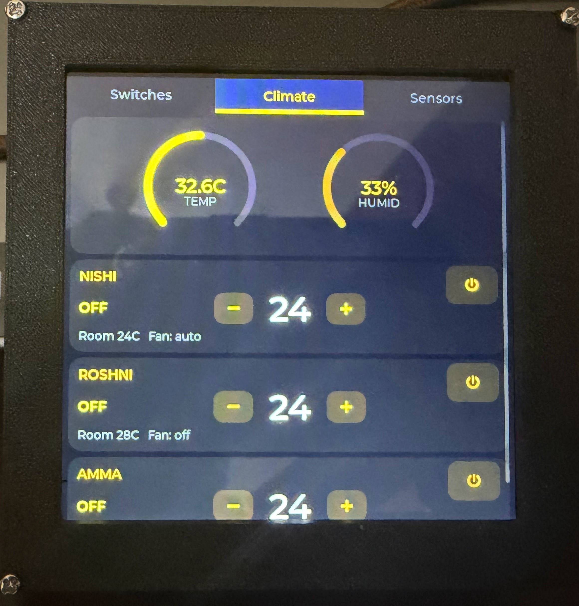
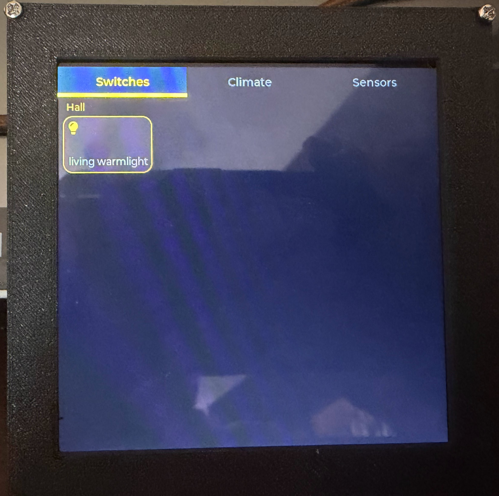

<p align="center">
  
</p>

<h1 align="center">Touch-i</h1>
<p align="center"><strong>by IoT Everythin</strong></p>
<p align="center">
  A wall-mounted Home Assistant control panel on the Waveshare ESP32-S3-Touch-LCD-4
</p>

<p align="center">
  
  
</p>

---

## What is Touch-i?

Touch-i turns a **Waveshare ESP32-S3-Touch-LCD-4** (480x480 touch display) into a fully dynamic Home Assistant control panel. No entity IDs are hardcoded in firmware. Everything is configured through a custom HACS sidebar panel that pushes configuration to the device over the local network.

**Key features:**

- **3-tab UI** with configurable 3rd tab (Sensors, Media, or Presence)
- **Switches tab** for lights and switches grouped by room/area, with dimmer and RGB support
- **Climate tab** with live temperature/humidity gauges and AC control cards
- **Media tab** with play/pause, prev/next, and volume control for media players
- **Presence tab** showing who's home with person entity tiles
- **Zero-code setup** from the HACS panel, hit Push, done
- **Auto token management** with no manual long-lived token creation
- **Screen sleep** with configurable brightness and auto-off timeout with touch-to-wake
- **Battery monitoring** with voltage, percentage, charge status, and low battery red accent
- **Dual-core architecture** with UI on Core 1 and HA polling on Core 0 (no lag)

---

## Hardware

| Component | Detail |
|-----------|--------|
| Board | [Waveshare ESP32-S3-Touch-LCD-4](https://www.waveshare.com/esp32-s3-touch-lcd-4.htm) (V4, SKU 28154) |
| SoC | ESP32-S3-N16R8 — 240 MHz dual-core, 16 MB Flash, 8 MB OPI PSRAM |
| Display | 4″ 480×480 ST7701S RGB LCD (16-bit parallel) |
| Touch | GT911 capacitive (I²C) |
| IO Expander | CH32V003 at I²C 0x24 (backlight PWM, battery ADC, GPIO) |
| Power | USB-C, optional LiPo battery with onboard charger |

---

## Architecture

```
┌─────────────────────────────────────────────────────┐
│  Home Assistant                                     │
│                                                     │
│  ┌────────────────────────────────────────────┐      │
│  │  HACS Integration (ioteverythin_display)   │      │
│  │  ├── __init__.py     setup + sidebar panel │      │
│  │  ├── config_flow.py  device setup wizard   │      │
│  │  ├── websocket_api.py  WS bridge commands  │      │
│  │  └── www/panel.js    sidebar UI            │      │
│  └────────────────────────────────────────────┘      │
│         │ WebSocket                ▲                  │
│         ▼                         │                  │
│  ┌──────────────┐                 │                  │
│  │  Browser Tab  │─────────────────┘                  │
│  │  (panel.js)   │──── HTTP POST /api/config ────┐   │
│  └──────────────┘                                │   │
└──────────────────────────────────────────────────│───┘
                                                   │
                    Local Network (HTTP)            │
                                                   ▼
┌─────────────────────────────────────────────────────┐
│  ESP32-S3 Display (Touch-i)                         │
│                                                     │
│  ┌────────────────────────────────────────────┐      │
│  │  Config Server (:8080)                     │      │
│  │  GET  /api/info   → device info + battery  │      │
│  │  GET  /api/config → current entity config  │      │
│  │  POST /api/config → receive new config     │      │
│  └────────────────────────────────────────────┘      │
│                                                     │
│  ┌────────────────────────────────────────────┐      │
│  │  ha.cpp — HA Control Panel                 │      │
│  │  Core 1: LVGL UI rendering (loop)          │      │
│  │  Core 0: FreeRTOS HTTP fetch task          │      │
│  │                                            │      │
│  │  Tab 1: Switches (grid, dimmer, RGB)       │      │
│  │  Tab 2: Climate (temp/hum arcs, AC cards)  │      │
│  │  Tab 3: Sensors / Media / Presence         │      │
│  └────────────────────────────────────────────┘      │
│                    │                                 │
│                    │  REST API (Bearer token)        │
│                    │  GET  /api/states/{entity_id}   │
│                    │  POST /api/services/{domain}/…  │
│                    ▼                                 │
│           Home Assistant :8123                       │
└─────────────────────────────────────────────────────┘
```

### Data Flow

There are two separate communication paths:

**1. Config Push (one-time setup)**

```
HACS Panel (browser)  ──HTTP POST──►  ESP32 :8080/api/config
```

The browser-based panel collects entity selections and pushes them directly to the ESP32. The integration auto-injects the HA URL and a long-lived access token into the payload. The ESP32 stores everything in NVS flash (Preferences) and rebuilds its UI on the fly — no reboot needed.

**2. State Polling (continuous operation)**

```
ESP32 (Core 0)  ──GET /api/states/{eid}──►  Home Assistant :8123
ESP32 (Core 0)  ◄── JSON state response ──  Home Assistant :8123
```

Once configured, the ESP32 talks **directly** to Home Assistant's REST API. It polls each entity individually (~5 second cycle) on Core 0 via a FreeRTOS task. Core 1 handles LVGL rendering so the UI stays responsive. The HACS integration is **not** in the data path during normal operation.

**Service calls** (toggle light, set AC temp, etc.) go directly from the ESP32 to HA via `POST /api/services/{domain}/{service}`.

---

## Display Features

### Screen Sleep

The CH32V003 IO expander controls backlight brightness via PWM:

- **Brightness**: Adjustable 10-100% from the HACS panel
- **Auto-off timeout**: Configurable (disabled / 10s / 30s / 1min / 2min / 5min / 10min)
- **Touch-to-wake**: Any touch wakes the screen; first touch is consumed (prevents accidental taps)
- **Sleep mode**: Screen goes black + backlight to minimum (BOOST_EN stays on for touch wake)
- Settings persist across reboots (saved to NVS flash)

### Battery Monitoring

For portable/battery-powered setups:

- **Voltage reading** via CH32V003 ADC (10-bit, ~2:1 voltage divider)
- **Charge detection** via EXIO0 input pin (active-low charger status)
- **Low battery accent**: UI accent color changes from gold to red at 10% or below (5% hysteresis)
- Battery info displayed in the HACS panel's info bar

---

## HACS Panel

The sidebar panel (`panel.js`) is the primary configuration interface:

| Tab | What you configure |
|-----|--------------------|
| **Switches** | Light/switch entities with alias, icon, area, dimmable/RGB flags |
| **Climate** | Temperature and humidity sensors, AC/climate entities with min/max temp |
| **Sensors** | Door/contact sensors (with inverted option), motion/occupancy sensors |
| **Media** | Media player entities for playback control on the display |
| **Persons** | Person entities for presence tracking on the display |
| **Display** | Brightness slider, screen timeout, 3rd tab selector, battery status |

### Auto Token Management

The integration creates a long-lived access token automatically on first config push. No manual token setup is needed — the token is generated via `hass.auth`, injected into the config payload, and stored on the ESP32.

---

## Installation

### Prerequisites

- [PlatformIO](https://platformio.org/) (VS Code extension or CLI)
- Waveshare ESP32-S3-Touch-LCD-4 (V4) connected via USB
- Home Assistant with [HACS](https://hacs.xyz/) installed

### 1. Flash Firmware

```bash
# Clone and build
git clone https://github.com/joelvarun/ioteverythin-display.git
cd ioteverythin-display

# Build
pio run

# Flash (adjust COM port)
pio run -t upload --upload-port COM8
```

On first boot, the display starts a WiFi AP:
- **SSID**: `SmartDisplay`
- **Password**: `setup1234`

Connect and configure your WiFi credentials via the captive portal.

### 2. Install HACS Integration

1. In HACS, go to **Integrations → ⋮ → Custom repositories**
2. Add: `joelvarun/ioteverythin-display` (category: Integration)
3. Search for **Touch-i by IoT Everythin** and install
4. Restart Home Assistant
5. Go to **Settings → Integrations → Add Integration → Touch-i**
6. Enter the display's IP address (shown on the display after WiFi setup)

### 3. Configure Entities

1. Open the **Touch-i** sidebar panel
2. Add your lights, climate devices, and sensors
3. Click **Push Config**
4. The display rebuilds its UI automatically

---

## Firmware Source Files

| File | Purpose |
|------|---------|
| `src/main.cpp` | Boot sequence — display → WiFi → config server → HA UI |
| `src/ha.cpp` | HA control panel with 3 tabs, dynamic entities, media/presence, FreeRTOS fetch |
| `src/config_server.cpp` | REST API on :8080 for config push/pull (FW v1.2.0) |
| `src/display_hal.cpp` | Display init, backlight PWM (CH32V003), battery ADC, screen sleep |
| `src/wifi_mgr.cpp` | WiFiManager-style AP provisioning + auto-reconnect |
| `src/config.h` | Pin definitions and defaults |
| `src/fa_icons.c` | FontAwesome icon subset for LVGL |

---

## Config JSON Schema

The HACS panel pushes this JSON to the ESP32 via `POST /api/config`:

```json
{
  "ha_url": "http://homeassistant.local:8123",
  "ha_token": "eyJ...",
  "lights": [
    {
      "eid": "light.hall_light",
      "label": "Hall Light",
      "icon": "bulb",
      "dimmable": true,
      "rgb": false,
      "cat": "Hall",
      "domain": "light"
    }
  ],
  "climate": {
    "temp_sensor": "sensor.indoor_temperature",
    "hum_sensor": "sensor.indoor_humidity",
    "acs": [
      {
        "eid": "climate.bedroom_ac",
        "label": "Bedroom AC",
        "min": 16,
        "max": 30
      }
    ]
  },
  "sensors": {
    "doors": [
      {
        "eid": "binary_sensor.front_door",
        "label": "Front Door",
        "inverted": false
      }
    ],
    "motion": [
      {
        "eid": "binary_sensor.hallway_motion",
        "label": "Hallway"
      }
    ]
  },
  "media": [
    {
      "eid": "media_player.living_room",
      "label": "Living Room"
    }
  ],
  "persons": [
    {
      "eid": "person.joel",
      "label": "Joel"
    }
  ],
  "tab3": "sensors",
  "display": {
    "brightness": 80,
    "timeout": 60
  }
}
```

New in v1.2.0: `media`, `persons`, and `tab3` fields for configurable 3rd tab.

---

## Design Decisions

| Decision | Why |
|----------|-----|
| Per-entity polling (not bulk `/api/states`) | Bulk returns 600+ entities (~200 KB), too large for PSRAM |
| PSRAM for entity arrays | Keeps main SRAM free for LVGL and stack |
| FreeRTOS dual-core split | Core 0 = blocking HTTP, Core 1 = responsive UI |
| NVS Preferences for config | Survives reboot, no filesystem overhead |
| Auto token creation | Users never touch HA's token page |
| Dynamic areas/categories | Built from config, not hardcoded |
| Configurable 3rd tab | Users pick Sensors, Media, or Presence from the HACS panel |
| Config push (not pull) | ESP32 is passive, panel pushes when ready |
| CH32V003 PWM for backlight | Hardware PWM via IO expander, no GPIO needed from ESP32 |
| Low battery red accent | Gold-to-red at 10% with 5% hysteresis |

---

## License

MIT

---

<p align="center">
  <br>
  <sub>Touch-i by IoT Everythin</sub>
</p>
